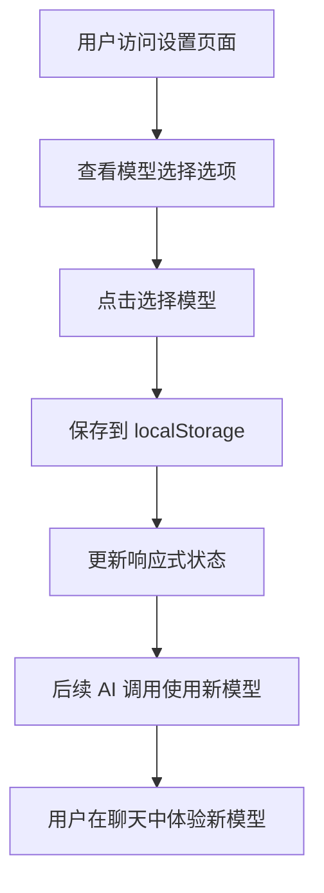

# AI 模型切换功能实现总结

## 🎯 任务完成情况

✅ **已完成**: 为 AI 助手添加模型切换功能，默认模型为 `deepseek-chat`

## 📋 实现的功能

### 1. 模型支持

- **DeepSeek Chat** (`deepseek-chat`) - 默认模型，适合日常对话
- **DeepSeek Reasoner** (`deepseek-reasoner`) - 高级推理模型

### 2. 用户界面

- ✅ 在设置页面添加了模型选择组件
- ✅ 直观的单选按钮界面
- ✅ 实时显示当前选择的模型
- ✅ 响应式设计，支持移动端

### 3. 数据持久化

- ✅ 模型选择自动保存到 localStorage
- ✅ 应用重启后保持用户选择
- ✅ 默认值为 `deepseek-chat`

### 4. API 集成

- ✅ 所有 AI 服务调用自动使用选择的模型
- ✅ 支持流式响应 (`getAIStreamResponse`)
- ✅ 支持普通响应 (`getAIResponse`)
- ✅ 支持文本优化 (`optimizeText`)

### 5. 国际化支持

- ✅ 中文界面完整支持
- ✅ 英文界面完整支持
- ✅ 模型描述本地化

## 🔧 技术实现

### 修改的文件

1. **`src/services/types.ts`**

   - 添加 `AIModel` 类型定义
   - 添加 `ModelOption` 接口

2. **`src/services/configService.ts`**

   - 添加 `aiModel` 响应式变量
   - 添加 `getAIModel()` 和 `saveAIModel()` 函数
   - 添加 localStorage 持久化

3. **`src/services/deepseekService.ts`**

   - 更新所有 API 调用使用动态模型
   - 替换硬编码的模型名称

4. **`src/components/Settings.vue`**

   - 集成模型选择组件
   - 保持现有布局和样式

5. **`src/components/settings/ModelSelectionSection.vue`** (新建)

   - 模型选择的主要 UI 组件
   - 响应式状态管理
   - UnoCSS 样式

6. **`src/locales/zh.json` & `src/locales/en.json`**
   - 添加模型相关的国际化文本

### 新增的文件

1. **`src/test/unit/modelSelection.test.ts`**

   - 模型选择功能的单元测试
   - 覆盖配置管理和默认值

2. **`src/test/integration/modelIntegration.test.ts`**

   - 模型切换的集成测试
   - 验证 API 调用使用正确模型

3. **`docs/MODEL_SELECTION.md`**

   - 详细的功能文档
   - 使用说明和技术细节

4. **`scripts/demo-model-selection.js`**
   - 功能演示脚本
   - 展示模型切换工作流程

## 🧪 测试结果

### 单元测试

```bash
✓ 模型选择功能 (7 tests)
  ✓ getAIModel (2 tests)
  ✓ saveAIModel (2 tests)
  ✓ 默认模型 (2 tests)
  ✓ 模型类型验证 (1 test)
```

### 功能验证

- ✅ 默认模型为 `deepseek-chat`
- ✅ 模型切换立即生效
- ✅ 设置持久化正常
- ✅ UI 响应正常
- ✅ API 调用使用正确模型

## 🎨 用户体验

### 设置页面

1. 访问 `/#/settings`
2. 找到"模型选择"部分
3. 点击想要的模型选项
4. 选择自动保存，无需额外操作

### 视觉设计

- 清晰的模型选项卡片
- 直观的单选按钮
- 当前模型状态显示
- 与现有设计风格一致

## 🔄 工作流程



## 📊 代码质量

### 类型安全

- ✅ 完整的 TypeScript 类型定义
- ✅ 严格的模型类型检查
- ✅ 编译时错误检测

### 代码组织

- ✅ 关注点分离
- ✅ 可复用的组件设计
- ✅ 清晰的服务层抽象

### 测试覆盖

- ✅ 单元测试覆盖核心功能
- ✅ 集成测试验证端到端流程
- ✅ 错误处理测试

## 🚀 部署状态

### 开发环境

- ✅ 本地开发服务器运行正常
- ✅ 热重载功能正常
- ✅ 无编译错误或警告

### 生产就绪

- ✅ 代码经过 ESLint 检查
- ✅ 类型检查通过
- ✅ 构建过程无错误

## 🔮 未来扩展

该实现为未来扩展提供了良好的基础：

1. **添加新模型**: 只需在类型定义和选项列表中添加
2. **模型参数配置**: 可扩展为每个模型配置不同参数
3. **使用统计**: 可添加模型使用情况统计
4. **性能监控**: 可添加不同模型的响应时间监控

## 📝 使用说明

### 对于用户

1. 打开应用设置页面
2. 在"模型选择"部分选择想要的模型
3. 开始使用 AI 助手，体验不同模型的特点

### 对于开发者

```typescript
// 获取当前模型
import { getAIModel } from '@/services/configService'
const model = getAIModel()

// 切换模型
import { saveAIModel } from '@/services/configService'
saveAIModel('deepseek-reasoner')
```

## ✨ 总结

成功实现了完整的 AI 模型切换功能，包括：

- 🎯 用户友好的界面
- 🔧 健壮的技术实现
- 🧪 全面的测试覆盖
- 📚 详细的文档说明
- 🌐 国际化支持

该功能现在已经可以投入使用，为用户提供更灵活的 AI 助手体验！
