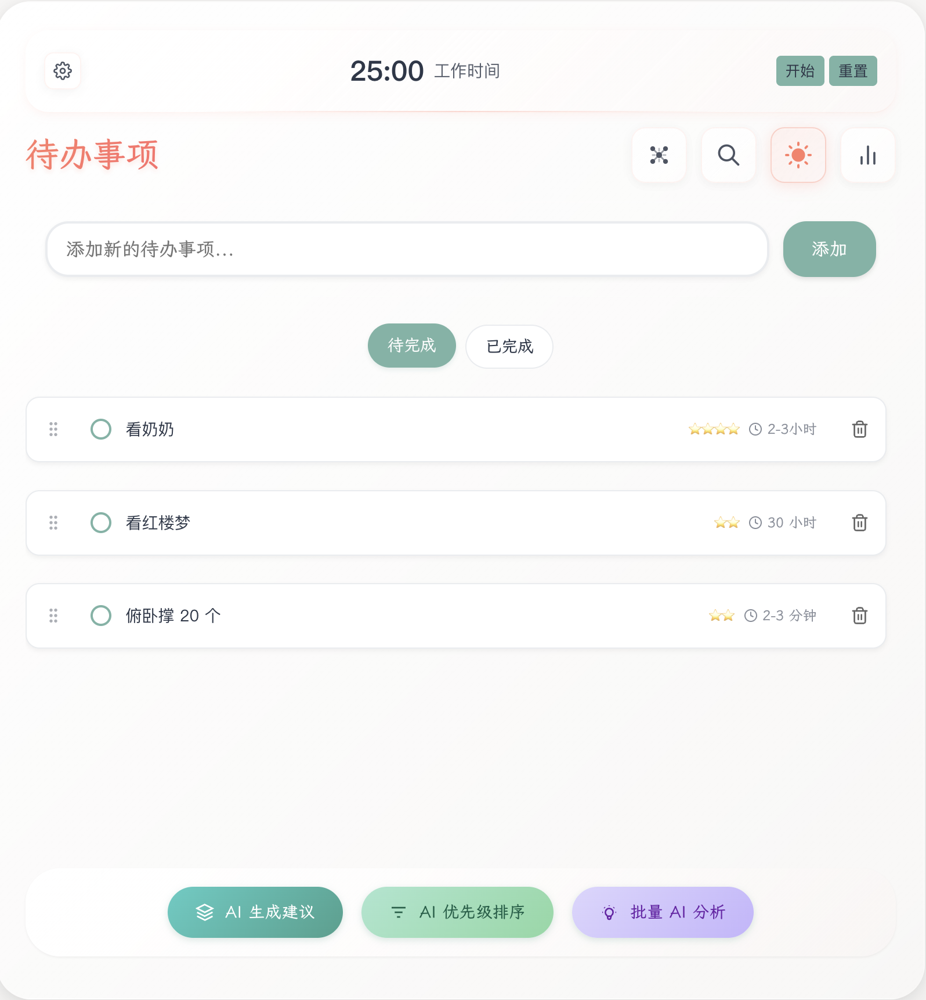

# Yun AI TodoList

基于 Vue 3 + NestJS +
Electron 构建的现代化 AI 智能待办事项应用，支持跨平台使用。


## 📸 应用截图



## ✨ 功能特性

- 📝 **任务管理**：创建、编辑、删除待办事项，支持优先级、标签、截止日期
- 🎯 **项目管理**：任务分类管理，项目统计和进度跟踪
- 🤖 **AI 助手**：智能任务建议和 Google 搜索集成（MCP 协议）
- 🎵 **语音输入**：支持语音识别输入任务
- 📊 **数据可视化**：任务统计图表和历史记录分析
- 🌐 **跨平台**：支持 Web、桌面（Electron）和移动端
- 🎨 **现代界面**：响应式设计，支持深色模式和多语言
- 🔒 **安全可靠**：JWT 认证，数据加密存储

## 🚀 快速开始

### 环境要求

- **Node.js** >= 18.0.0
- **pnpm** >= 9.0.0
- **Docker** (推荐)

### Docker 部署 (推荐)

```bash
# 克隆项目
git clone https://github.com/xixixiaoyu/todo.git
cd yun-ai-todolist

# 启动开发环境
cp .env.example .env
./scripts/docker-build.sh start dev

# 访问应用
# 前端: http://localhost:3001
# 后端: http://localhost:3000
```

### 本地开发

```bash
# 安装依赖
pnpm install

# 配置环境变量
cp .env.example .env

# 启动服务
pnpm dev:all
```

### 构建部署

```bash
# 构建所有应用
pnpm build

# 桌面应用构建
pnpm --filter frontend electron:build:mac  # macOS
pnpm --filter frontend electron:build:win  # Windows

# 移动应用构建
pnpm --filter frontend mobile:build

# 生产环境部署
docker-compose -f docker-compose.prod.yml up -d

# Cloudflare Workers 部署
pnpm deploy:cf:prod
```

## 🛠️ 技术栈

**前端**: Vue 3 + TypeScript + Vite + UnoCSS + Chart.js  
**后端**: NestJS + Prisma + PostgreSQL + Redis + JWT  
**跨平台**: Electron + Capacitor  
**AI 集成**: Google Search CLI + MCP 协议 + Playwright  
**开发工具**: pnpm + Docker + ESLint + Prettier

## 📚 文档

- [Docker 部署指南](./docs/DOCKER.md)
- [Cloudflare 部署指南](./docs/CLOUDFLARE-DEPLOYMENT.md)
- [后端 API 文档](./apps/backend/docs/API.md)
- [Google 搜索工具](./google-search/README.md)

## 📁 项目结构

```
yun-ai-todolist/
├── apps/
│   ├── backend/                 # NestJS 后端
│   └── frontend/               # Vue 3 前端
├── google-search/              # Google 搜索工具
├── docs/                       # 项目文档
├── scripts/                    # 构建脚本
└── docker/                     # Docker 配置
```

## 🤝 贡献指南

1. Fork 本仓库
2. 创建特性分支 (`git checkout -b feature/AmazingFeature`)
3. 提交更改 (`git commit -m 'Add some AmazingFeature'`)
4. 推送到分支 (`git push origin feature/AmazingFeature`)
5. 开启 Pull Request

## 📄 许可证

本项目采用 [GNU General Public License v3.0](LICENSE) 许可证。

---

<div align="center">
  <p>如果这个项目对你有帮助，请给我们一个 ⭐️ Star！</p>
</div>
