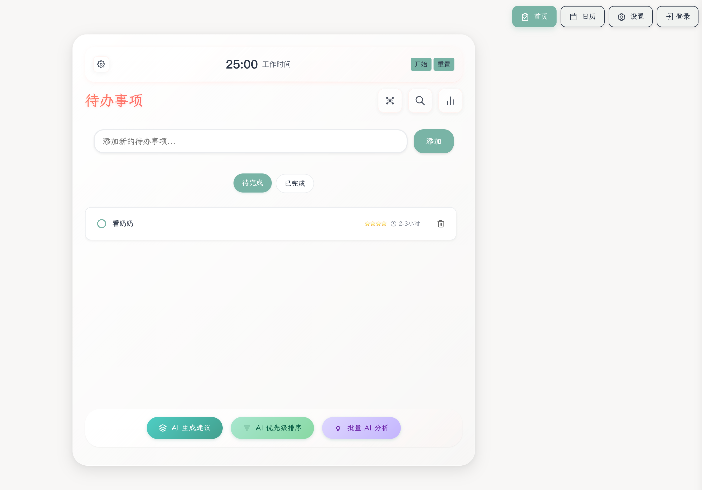
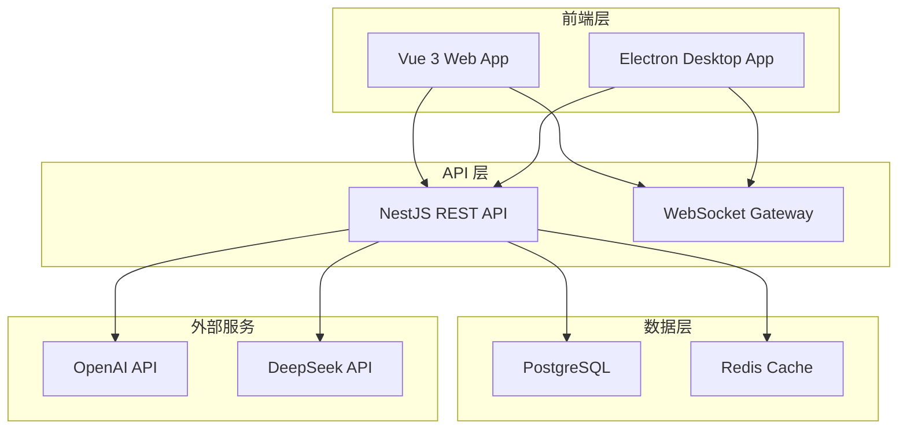

<div align="center">
  <h1>🚀 Yun AI TodoList</h1>
  <p><strong>现代化 AI 智能待办事项管理应用</strong></p>
  <p>基于 Vue 3 + NestJS + Electron 构建的全栈解决方案，支持 Web 端和跨平台桌面应用</p>
  
  
  
  
  
  
  
  
  
  
  <p>
    <a href="#-快速开始">快速开始</a> •
    <a href="#-功能特性">功能特性</a> •
    <a href="#-技术栈">技术栈</a> •
    <a href="#-部署指南">部署指南</a> •
    <a href="#-贡献指南">贡献指南</a>
  </p>
</div>

## 📖 项目简介

**Yun AI TodoList** 是一个现代化的全栈智能待办事项管理应用，采用 **Monorepo**
架构设计，集成了前沿的 AI 技术和优雅的用户体验。

### 🎯 设计理念

- **🧠 AI 驱动**: 集成智能助手，提供任务建议和优化方案
- **🌐 全平台覆盖**: 支持 Web 端、Windows、macOS、Linux 桌面应用
- **⚡ 现代化架构**: 采用 TypeScript 全栈开发，确保代码质量和开发效率
- **🔒 企业级安全**: JWT 认证、数据加密、安全最佳实践
- **📊 数据可视化**: 直观的图表分析，洞察任务完成趋势
- **🎨 优雅设计**: 响应式 UI，支持主题切换和国际化

## 📸 应用截图

<div align="center">
  
</div>

## ✨ 功能特性

### 🎯 核心功能

| 功能模块            | 描述                                   | 技术实现                   |
| ------------------- | -------------------------------------- | -------------------------- |
| **📝 智能任务管理** | 完整的 CRUD 操作、拖拽排序、优先级分析 | Vue 3 + Pinia + TypeScript |
| **🤖 AI 智能助手**  | 任务建议、时间估算、智能分类           | OpenAI API + DeepSeek API  |
| **🔍 实时搜索**     | 网络搜索、搜索历史、智能建议           | NestJS + PostgreSQL        |
| **📊 数据可视化**   | 任务统计、完成趋势、效率分析           | Chart.js + 自定义图表      |
| **🔐 安全认证**     | JWT 认证、自动刷新、会话管理           | Passport + JWT Strategy    |
| **🌍 国际化支持**   | 多语言切换、本地化配置                 | Vue I18n                   |

### 🚀 高级特性

- **⚡ 实时同步**: WebSocket 连接，多端数据实时同步
- **📱 响应式设计**: 完美适配桌面、平板、手机设备
- **🎨 主题系统**: 支持亮色/暗色主题，自定义配色方案
- **📋 标签管理**: 灵活的标签系统，支持颜色分类
- **⏰ 提醒通知**: 到期提醒、桌面通知、邮件提醒
- **📈 性能优化**: 虚拟滚动、懒加载、缓存策略
- **🔄 离线支持**: PWA 技术，支持离线使用
- **📤 数据导出**: 支持 JSON、CSV、PDF 格式导出

## 🛠️ 技术栈

### 前端技术

| 技术           | 版本 | 用途                  |
| -------------- | ---- | --------------------- |
| **Vue 3**      | 3.5+ | 渐进式前端框架        |
| **TypeScript** | 5.x  | 类型安全的 JavaScript |
| **Vite**       | 5.x  | 现代化构建工具        |
| **Pinia**      | 2.x  | 状态管理库            |
| **Vue Router** | 4.x  | 单页应用路由          |
| **Naive UI**   | 2.x  | Vue 3 组件库          |
| **UnoCSS**     | -    | 原子化 CSS 引擎       |
| **Chart.js**   | -    | 数据可视化图表        |
| **Vue I18n**   | 9.x  | 国际化解决方案        |

### 后端技术

| 技术           | 版本 | 用途                  |
| -------------- | ---- | --------------------- |
| **NestJS**     | 10.x | Node.js 企业级框架    |
| **TypeScript** | 5.x  | 类型安全的 JavaScript |
| **Prisma**     | 6.x  | 现代化 ORM            |
| **PostgreSQL** | 13+  | 关系型数据库          |
| **Redis**      | 6.0+ | 缓存和会话存储        |
| **JWT**        | -    | 身份认证              |
| **Passport**   | -    | 认证中间件            |
| **Swagger**    | -    | API 文档生成          |

### 桌面端技术

| 技术                 | 版本 | 用途           |
| -------------------- | ---- | -------------- |
| **Electron**         | 36.x | 跨平台桌面应用 |
| **Electron Builder** | 26.x | 应用打包和分发 |

### 开发工具

| 工具           | 用途         |
| -------------- | ------------ |
| **pnpm**       | 包管理器     |
| **ESLint**     | 代码质量检查 |
| **Prettier**   | 代码格式化   |
| **Husky**      | Git 钩子管理 |
| **Commitlint** | 提交信息规范 |
| **Playwright** | E2E 测试     |
| **Vitest**     | 单元测试     |
| **Docker**     | 容器化部署   |

## 🏛️ 架构设计

### 📁 项目结构

```
yun-ai-todolist/
├── 📁 apps/                    # 应用模块
│   ├── 📁 frontend/            # Vue 3 前端应用
│   │   ├── 📁 src/
│   │   │   ├── 📁 components/  # 可复用组件
│   │   │   ├── 📁 views/       # 页面组件
│   │   │   ├── 📁 stores/      # Pinia 状态管理
│   │   │   ├── 📁 composables/ # 组合式函数
│   │   │   ├── 📁 utils/       # 工具函数
│   │   │   └── 📁 types/       # 类型定义
│   │   └── 📄 README.md
│   └── 📁 backend/             # NestJS 后端服务
│       ├── 📁 src/
│       │   ├── 📁 modules/     # 功能模块
│       │   ├── 📁 common/      # 公共模块
│       │   ├── 📁 guards/      # 路由守卫
│       │   ├── 📁 decorators/  # 装饰器
│       │   └── 📁 types/       # 类型定义
│       ├── 📁 prisma/          # 数据库模式
│       └── 📄 README.md
├── 📁 packages/                # 共享代码库
│   └── 📁 shared/              # 前后端共享类型和工具
├── 📁 electron/                # Electron 配置
│   ├── 📄 main.js              # 主进程
│   └── 📄 preload.js           # 预加载脚本
├── 📁 scripts/                 # 构建和部署脚本
├── 📁 tools/                   # 开发工具配置
├── 📁 tests/                   # 测试文件
├── 📄 docker-compose.yml       # Docker 编排
├── 📄 package.json             # 项目配置
└── 📄 pnpm-workspace.yaml      # Monorepo 配置
```

### 🔄 系统架构



## 🚀 快速开始

### 📋 环境要求

| 工具           | 版本要求  | 说明              |
| -------------- | --------- | ----------------- |
| **Node.js**    | >= 18.0.0 | JavaScript 运行时 |
| **pnpm**       | >= 9.0.0  | 包管理器          |
| **Docker**     | >= 20.0.0 | 容器化部署 (可选) |
| **PostgreSQL** | >= 13.0   | 数据库 (本地开发) |
| **Redis**      | >= 6.0    | 缓存服务 (可选)   |

### 🐳 Docker 一键部署 (推荐)

```bash
# 1. 克隆项目
git clone https://github.com/yunmu/yun-ai-todolist.git
cd yun-ai-todolist

# 2. 配置环境变量
cp .env.example .env
# 编辑 .env 文件，配置数据库和 AI API 密钥

# 3. 启动所有服务
docker-compose up -d

# 4. 查看服务状态
docker-compose ps
```

### 🛠️ 本地开发环境

#### 1️⃣ 安装依赖

```bash
# 安装所有依赖
pnpm install

# 构建共享包
pnpm build:shared
```

#### 2️⃣ 配置数据库

```bash
# 启动 PostgreSQL (使用 Docker)
docker run -d \
  --name postgres-todo \
  -e POSTGRES_DB=yun_todo_db \
  -e POSTGRES_USER=yun_todo_user \
  -e POSTGRES_PASSWORD=postgres123 \
  -p 5432:5432 \
  postgres:13

# 运行数据库迁移
pnpm --filter backend migration:run

# 填充示例数据 (可选)
pnpm --filter backend seed
```

#### 3️⃣ 启动开发服务

```bash
# 方式一：同时启动前后端
pnpm dev:all

# 方式二：分别启动
# 终端 1 - 启动后端
pnpm dev:backend

# 终端 2 - 启动前端
pnpm dev
```

#### 4️⃣ 构建桌面应用

```bash
# 开发模式运行桌面应用
pnpm electron:dev

# 构建桌面应用
pnpm electron:build
```

### 🌐 访问应用

| 服务         | 地址                           | 说明            |
| ------------ | ------------------------------ | --------------- |
| **前端应用** | http://localhost:5173          | Vue 3 Web 应用  |
| **后端 API** | http://localhost:3000          | NestJS REST API |
| **API 文档** | http://localhost:3000/api/docs | Swagger 文档    |
| **桌面应用** | -                              | Electron 应用   |

### 📚 详细开发指南

- 📖 **[前端开发指南](./apps/frontend/README.md)** - Vue 3 应用开发
- 📖 **[后端开发指南](./apps/backend/README.md)** - NestJS API 开发
- 🖥️ **[桌面应用指南](./electron/README.md)** - Electron 桌面应用开发

## 🚀 部署指南

### 🌐 生产环境部署

#### Docker 生产部署

```bash
# 1. 构建生产镜像
docker-compose -f docker-compose.prod.yml build

# 2. 启动生产服务
docker-compose -f docker-compose.prod.yml up -d

# 3. 配置 Nginx 反向代理
# 参考 nginx/nginx.conf 配置文件
```

#### 云平台部署

| 平台        | 部署方式     | 配置文件       |
| ----------- | ------------ | -------------- |
| **Vercel**  | 前端静态部署 | `vercel.json`  |
| **Railway** | 全栈部署     | `railway.toml` |
| **AWS**     | ECS + RDS    | `aws/` 目录    |
| **阿里云**  | ECS + RDS    | `aliyun/` 目录 |

### 📱 桌面应用分发

```bash
# 构建所有平台的桌面应用
pnpm electron:build

# 构建特定平台
pnpm electron:build --win    # Windows
pnpm electron:build --mac    # macOS
pnpm electron:build --linux  # Linux
```

## 🧪 测试指南

### 🔬 单元测试

```bash
# 运行所有单元测试
pnpm test

# 运行测试覆盖率
pnpm test:coverage

# 监听模式运行测试
pnpm test --watch
```

### 🎭 E2E 测试

```bash
# 运行 E2E 测试
pnpm test:e2e

# 可视化模式运行
pnpm test:e2e:ui

# 调试模式运行
pnpm test:e2e:debug
```

### 📊 性能测试

```bash
# 运行性能基准测试
pnpm perf:benchmark

# 分析构建产物大小
pnpm analyze
```

## 🤝 贡献指南

我们热烈欢迎社区贡献！无论是 Bug 修复、功能增强还是文档改进，都非常感谢您的参与。

### 📝 贡献流程

1. **🍴 Fork 项目**

   ```bash
   git clone https://github.com/your-username/yun-ai-todolist.git
   cd yun-ai-todolist
   ```

2. **🌿 创建功能分支**

   ```bash
   git checkout -b feature/your-feature-name
   ```

3. **💻 开发和测试**

   ```bash
   # 安装依赖
   pnpm install

   # 运行测试
   pnpm test

   # 代码格式化
   pnpm format
   ```

4. **📤 提交代码**

   ```bash
   git add .
   git commit -m "feat: add your feature description"
   git push origin feature/your-feature-name
   ```

5. **🔄 创建 Pull Request**
   - 详细描述您的更改
   - 关联相关的 Issue
   - 确保所有检查通过

### 📋 代码规范

- **提交信息**: 遵循 [Conventional Commits](https://conventionalcommits.org/)
  规范
- **代码风格**: 使用 ESLint + Prettier 自动格式化
- **类型检查**: 确保 TypeScript 类型检查通过
- **测试覆盖**: 新功能需要包含相应的测试用例

### 🐛 报告问题

发现 Bug？请通过
[GitHub Issues](https://github.com/yunmu/yun-ai-todolist/issues) 报告：

- 使用清晰的标题描述问题
- 提供详细的重现步骤
- 包含错误信息和截图
- 说明您的环境信息

### 💡 功能建议

有好的想法？欢迎提交功能请求：

- 详细描述功能需求
- 说明使用场景和价值
- 提供设计思路或原型

## 📄 许可证

本项目采用 **[GNU General Public License v3.0](LICENSE)** 开源许可证。

这意味着您可以：

- ✅ 自由使用、修改和分发
- ✅ 用于商业用途
- ✅ 获得源代码

但需要：

- ⚠️ 保持相同的开源许可证
- ⚠️ 公开源代码修改
- ⚠️ 包含原始许可证和版权声明

## 🙏 致谢

感谢所有为这个项目做出贡献的开发者们！

### 🌟 核心贡献者

- [@yunmu](https://github.com/yunmu) - 项目创建者和维护者

### 🎯 特别感谢

- [Vue.js](https://vuejs.org/) - 渐进式前端框架
- [NestJS](https://nestjs.com/) - 企业级 Node.js 框架
- [Electron](https://electronjs.org/) - 跨平台桌面应用框架
- 所有开源社区的贡献者们

---

<div align="center">
  <h3>🌟 如果这个项目对您有帮助，请给我们一个 Star！</h3>
  
  <p>
    <a href="https://github.com/yunmu/yun-ai-todolist/stargazers">
      
    </a>
    <a href="https://github.com/yunmu/yun-ai-todolist/network/members">
      
    </a>
    <a href="https://github.com/yunmu/yun-ai-todolist/issues">
      
    </a>
  </p>
  
  <p>
    <strong>📧 联系我们</strong><br>
    有问题或建议？欢迎通过 <a href="https://github.com/yunmu/yun-ai-todolist/issues">GitHub Issues</a> 联系我们
  </p>
  
  <p>
    <sub>Built with ❤️ by <a href="https://github.com/yunmu">yunmu</a> and <a href="https://github.com/yunmu/yun-ai-todolist/graphs/contributors">contributors</a></sub>
  </p>
</div>
