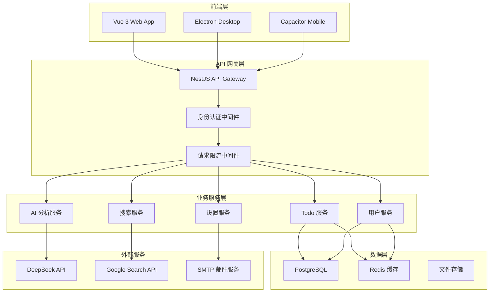
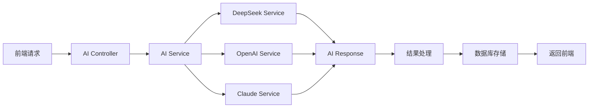
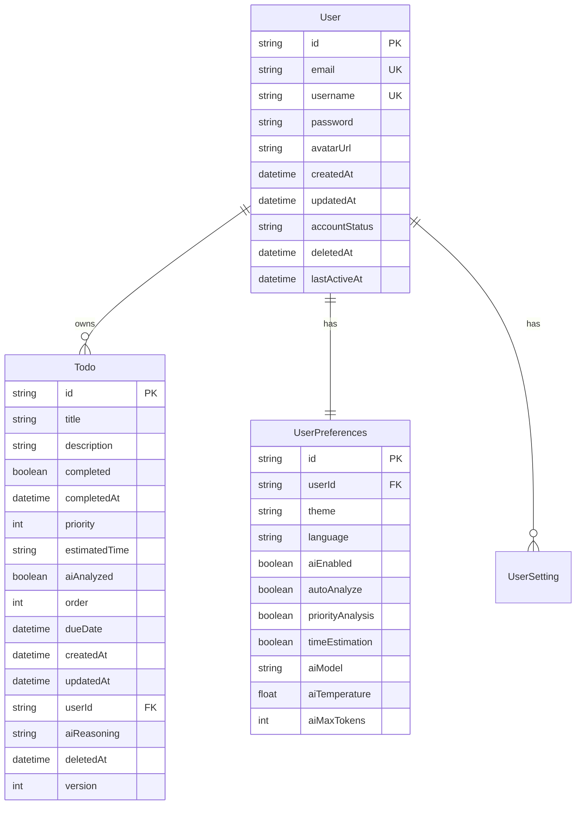
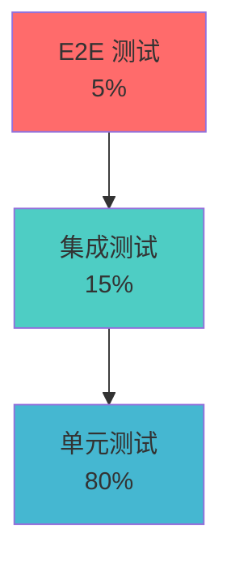

# Yun-AI-TodoList 系统实现文档

## 📋 目录

- [项目概述](#项目概述)
- [系统架构设计](#系统架构设计)
- [技术栈选型](#技术栈选型)
- [开发环境搭建](#开发环境搭建)
- [前端实现详解](#前端实现详解)
- [后端实现详解](#后端实现详解)
- [AI 功能实现](#ai-功能实现)
- [数据库设计与演进](#数据库设计与演进)
- [跨平台实现](#跨平台实现)
- [部署策略](#部署策略)
- [测试策略](#测试策略)
- [性能优化](#性能优化)
- [最佳实践](#最佳实践)
- [故障排除](#故障排除)

## 🎯 项目概述

Yun-AI-TodoList 是一个现代化的全栈 AI 智能待办事项应用，集成了先进的人工智能技术，为用户提供智能任务管理、优先级分析、时间估算和任务分解等功能。

### 核心特性

- **🤖 AI 智能分析**：基于 DeepSeek/OpenAI/Claude 的任务分析
- **📱 跨平台支持**：Web、桌面（Electron）、移动端（Capacitor）
- **🌐 多语言支持**：中文、英文国际化
- **🎨 主题切换**：日间/夜间模式
- **☁️ 混合存储**：本地存储 + 云端同步
- **🔄 实时同步**：多设备数据同步
- **📊 数据可视化**：任务统计和趋势分析

### 技术亮点

- **现代化架构**：Monorepo + 微服务
- **类型安全**：全栈 TypeScript
- **响应式设计**：移动优先的 UI/UX
- **容器化部署**：Docker + Kubernetes 支持
- **CI/CD 自动化**：GitHub Actions 完整流程

## 🏗️ 系统架构设计

### 整体架构图



### 核心设计原则

1. **单一职责原则**：每个服务模块职责明确
2. **开放封闭原则**：易于扩展，稳定核心
3. **依赖倒置原则**：面向接口编程
4. **最小权限原则**：安全第一的设计理念

## 🛠️ 技术栈选型

### 前端技术栈

| 技术       | 版本   | 选择理由                                |
| ---------- | ------ | --------------------------------------- |
| Vue 3      | 3.5.16 | Composition API、更好的 TypeScript 支持 |
| TypeScript | 5.8.3  | 类型安全、更好的开发体验                |
| Vite       | 最新   | 快速构建、热更新、ES 模块支持           |
| UnoCSS     | 最新   | 原子化 CSS、按需生成、性能优异          |
| Vue Router | 4.5.1  | 官方路由解决方案                        |
| VueUse     | 13.3.0 | 丰富的组合式 API 工具集                 |
| Chart.js   | 4.4.9  | 轻量级图表库、丰富的图表类型            |

### 后端技术栈

| 技术       | 版本 | 选择理由                       |
| ---------- | ---- | ------------------------------ |
| NestJS     | 10.x | 企业级框架、装饰器支持、模块化 |
| TypeScript | 5.x  | 与前端技术栈统一               |
| Prisma     | 6.x  | 类型安全的 ORM、优秀的开发体验 |
| PostgreSQL | 13+  | 可靠的关系型数据库、JSON 支持  |
| Redis      | 6.0+ | 高性能缓存、会话存储           |
| JWT        | 最新 | 无状态认证、跨域支持           |

### AI 和外部服务

| 服务          | 用途         | 特点                 |
| ------------- | ------------ | -------------------- |
| DeepSeek      | 主要 AI 服务 | 成本低、中文支持好   |
| OpenAI        | 备用 AI 服务 | 功能强大、生态丰富   |
| Claude        | 备用 AI 服务 | 安全性高、推理能力强 |
| Google Search | 网络搜索     | 搜索质量高、API 稳定 |

## 🚀 开发环境搭建

### 环境要求

```bash
# 基础环境
Node.js >= 18.0.0
pnpm >= 9.0.0
Git >= 2.30.0

# 数据库
PostgreSQL >= 13
Redis >= 6.0 (可选)

# 容器化 (推荐)
Docker >= 20.10.0
Docker Compose >= 2.0.0
```

### 项目初始化

```bash
# 1. 克隆项目
git clone https://github.com/your-username/Yun-AI-TodoList.git
cd Yun-AI-TodoList

# 2. 安装依赖
pnpm install

# 3. 配置环境变量
cp .env.example .env
# 编辑 .env 文件，配置必要的环境变量

# 4. 数据库初始化
pnpm --filter backend prisma:migrate
pnpm --filter backend prisma:seed

# 5. 启动开发服务
pnpm dev:all
```

### 开发工具配置

#### VS Code 推荐插件

```json
{
  "recommendations": [
    "vue.volar",
    "bradlc.vscode-tailwindcss",
    "esbenp.prettier-vscode",
    "dbaeumer.vscode-eslint",
    "prisma.prisma",
    "ms-vscode.vscode-typescript-next"
  ]
}
```

#### ESLint 配置

```javascript
// .eslintrc.js
module.exports = {
  root: true,
  extends: [
    '@yun-ai-todolist/eslint-config/vue',
    '@yun-ai-todolist/eslint-config/typescript',
  ],
  rules: {
    // 项目特定规则
  },
}
```

## 🎨 前端实现详解

### Vue 3 + Composition API 架构

#### 项目结构

```
apps/frontend/
├── src/
│   ├── components/          # 组件库
│   │   ├── common/         # 通用组件
│   │   ├── todo/           # Todo 相关组件
│   │   ├── ai/             # AI 功能组件
│   │   └── settings/       # 设置组件
│   ├── composables/        # 组合式 API
│   │   ├── useAI.ts        # AI 功能
│   │   ├── useTodos.ts     # Todo 管理
│   │   └── useSettings.ts  # 设置管理
│   ├── services/           # 服务层
│   │   ├── api.ts          # API 客户端
│   │   ├── aiService.ts    # AI 服务
│   │   └── storage.ts      # 存储服务
│   ├── stores/             # 状态管理
│   ├── types/              # 类型定义
│   └── utils/              # 工具函数
```

#### 核心 Composables 设计

```typescript
// composables/useAIAnalysis.ts
export function useAIAnalysis() {
  const isAnalyzing = ref(false)
  const analysisConfig = ref<AIAnalysisConfig>({
    enablePriorityAnalysis: true,
    enableTimeEstimation: true,
    model: 'deepseek-chat',
  })

  const analyzeSingleTodo = async (
    todo: Todo,
    updateCallback: (id: string, updates: Partial<Todo>) => void
  ) => {
    isAnalyzing.value = true
    try {
      const result = await analyzeTodo(todo.title)
      const updates: Partial<Todo> = {
        aiAnalyzed: true,
        priority: result.priority,
        estimatedTime: result.estimatedTime,
        updatedAt: new Date().toISOString(),
      }
      updateCallback(todo.id, updates)
    } catch (error) {
      console.error('AI 分析失败:', error)
      throw error
    } finally {
      isAnalyzing.value = false
    }
  }

  return {
    isAnalyzing: readonly(isAnalyzing),
    analysisConfig: readonly(analysisConfig),
    analyzeSingleTodo,
    // ... 其他方法
  }
}
```

#### 响应式状态管理

```typescript
// stores/todoStore.ts
export const useTodoStore = defineStore('todos', () => {
  const todos = ref<Todo[]>([])
  const filter = ref<TodoFilter>('all')
  const sortBy = ref<TodoSortField>('createdAt')

  // 计算属性
  const filteredTodos = computed(() => {
    return todos.value.filter((todo) => {
      switch (filter.value) {
        case 'active':
          return !todo.completed
        case 'completed':
          return todo.completed
        default:
          return true
      }
    })
  })

  // 异步操作
  const fetchTodos = async () => {
    try {
      const response = await api.get('/todos')
      todos.value = response.data
    } catch (error) {
      console.error('获取 Todo 失败:', error)
    }
  }

  return {
    todos: readonly(todos),
    filteredTodos,
    fetchTodos,
    // ... 其他方法
  }
})
```

### 组件设计模式

#### 智能组件 vs 展示组件

```vue
<!-- 智能组件：TodoList.vue -->
<template>
  <div class="todo-list">
    <TodoItem
      v-for="todo in filteredTodos"
      :key="todo.id"
      :todo="todo"
      @update="handleUpdate"
      @delete="handleDelete"
    />
  </div>
</template>

<script setup lang="ts">
import { useTodoStore } from '@/stores/todoStore'
import { useAIAnalysis } from '@/composables/useAIAnalysis'

const todoStore = useTodoStore()
const { analyzeSingleTodo } = useAIAnalysis()

const { filteredTodos } = storeToRefs(todoStore)

const handleUpdate = async (id: string, updates: Partial<Todo>) => {
  await todoStore.updateTodo(id, updates)
}
</script>
```

```vue
<!-- 展示组件：TodoItem.vue -->
<template>
  <div class="todo-item" :class="{ completed: todo.completed }">
    <input
      type="checkbox"
      :checked="todo.completed"
      @change="$emit('update', todo.id, { completed: $event.target.checked })"
    />
    <span class="todo-title">{{ todo.title }}</span>
    <div class="todo-meta">
      <span v-if="todo.priority" class="priority">
        {{ getPriorityStars(todo.priority) }}
      </span>
      <span v-if="todo.estimatedTime" class="time">
        {{ todo.estimatedTime }}
      </span>
    </div>
  </div>
</template>

<script setup lang="ts">
interface Props {
  todo: Todo
}

interface Emits {
  (e: 'update', id: string, updates: Partial<Todo>): void
  (e: 'delete', id: string): void
}

defineProps<Props>()
defineEmits<Emits>()
</script>
```

### 国际化实现

```typescript
// i18n/index.ts
import { createI18n } from 'vue-i18n'
import zhCN from './locales/zh-CN.json'
import enUS from './locales/en-US.json'

const i18n = createI18n({
  legacy: false,
  locale: 'zh-CN',
  fallbackLocale: 'en-US',
  messages: {
    'zh-CN': zhCN,
    'en-US': enUS,
  },
})

export default i18n
```

```json
// i18n/locales/zh-CN.json
{
  "todo": {
    "title": "待办事项",
    "add": "添加任务",
    "completed": "已完成",
    "priority": "优先级",
    "estimatedTime": "预估时间"
  },
  "ai": {
    "analyzing": "AI 分析中...",
    "analysisComplete": "分析完成",
    "analysisError": "分析失败，请重试"
  }
}
```

## 🔧 后端实现详解

### NestJS 模块化架构

#### 项目结构

```
apps/backend/
├── src/
│   ├── auth/               # 认证模块
│   ├── todos/              # Todo 模块
│   ├── ai-analysis/        # AI 分析模块
│   ├── users/              # 用户模块
│   ├── settings/           # 设置模块
│   ├── database/           # 数据库模块
│   ├── common/             # 通用模块
│   │   ├── decorators/     # 装饰器
│   │   ├── filters/        # 异常过滤器
│   │   ├── guards/         # 守卫
│   │   ├── interceptors/   # 拦截器
│   │   └── pipes/          # 管道
│   └── main.ts             # 应用入口
```

#### 核心模块实现

```typescript
// todos/todos.module.ts
@Module({
  imports: [DatabaseModule],
  controllers: [TodosController],
  providers: [TodosService, TodosRepository],
  exports: [TodosService],
})
export class TodosModule {}

// todos/todos.service.ts
@Injectable()
export class TodosService {
  constructor(
    private readonly todosRepository: TodosRepository,
    private readonly aiAnalysisService: AIAnalysisService
  ) {}

  async createTodo(
    userId: string,
    createTodoDto: CreateTodoDto
  ): Promise<Todo> {
    const todo = await this.todosRepository.create({
      ...createTodoDto,
      userId,
      order: await this.getNextOrder(userId),
    })

    // 如果启用了自动分析，触发 AI 分析
    if (createTodoDto.autoAnalyze) {
      this.aiAnalysisService.analyzeTodo(todo.id).catch((error) => {
        console.error('AI 分析失败:', error)
      })
    }

    return todo
  }

  async updateTodo(
    userId: string,
    id: string,
    updateTodoDto: UpdateTodoDto
  ): Promise<Todo> {
    const todo = await this.todosRepository.findOne({ id, userId })
    if (!todo) {
      throw new NotFoundException('Todo not found')
    }

    return this.todosRepository.update(id, {
      ...updateTodoDto,
      updatedAt: new Date(),
    })
  }
}
```

#### API 设计规范

```typescript
// todos/todos.controller.ts
@Controller('api/v1/todos')
@UseGuards(JwtAuthGuard)
@ApiTags('Todos')
export class TodosController {
  constructor(private readonly todosService: TodosService) {}

  @Post()
  @ApiOperation({ summary: '创建新的 Todo' })
  @ApiResponse({ status: 201, description: 'Todo 创建成功', type: Todo })
  async create(
    @GetUser() user: User,
    @Body() createTodoDto: CreateTodoDto
  ): Promise<Todo> {
    return this.todosService.createTodo(user.id, createTodoDto)
  }

  @Get()
  @ApiOperation({ summary: '获取用户的所有 Todo' })
  @ApiQuery({ name: 'filter', required: false, enum: TodoFilter })
  @ApiQuery({ name: 'sortBy', required: false, enum: TodoSortField })
  async findAll(
    @GetUser() user: User,
    @Query() query: GetTodosQueryDto
  ): Promise<Todo[]> {
    return this.todosService.findAllByUser(user.id, query)
  }
}
```

### 数据访问层设计

```typescript
// database/repositories/todos.repository.ts
@Injectable()
export class TodosRepository {
  constructor(private readonly prisma: PrismaService) {}

  async create(data: CreateTodoData): Promise<Todo> {
    return this.prisma.todo.create({
      data: {
        ...data,
        createdAt: new Date(),
        updatedAt: new Date(),
      },
    })
  }

  async findAllByUser(
    userId: string,
    options: FindTodosOptions = {}
  ): Promise<Todo[]> {
    const { filter, sortBy, sortDirection = 'desc' } = options

    const where: Prisma.TodoWhereInput = {
      userId,
      deletedAt: null,
    }

    if (filter === 'active') {
      where.completed = false
    } else if (filter === 'completed') {
      where.completed = true
    }

    return this.prisma.todo.findMany({
      where,
      orderBy: {
        [sortBy || 'createdAt']: sortDirection,
      },
    })
  }
}
```

## 🤖 AI 功能实现

### AI 服务架构



### DeepSeek API 集成

```typescript
// ai-analysis/services/deepseek.service.ts
@Injectable()
export class DeepSeekService {
  private readonly apiUrl = 'https://api.deepseek.com/v1/chat/completions'
  private readonly apiKey: string

  constructor(private readonly configService: ConfigService) {
    this.apiKey = this.configService.get<string>('DEEPSEEK_API_KEY')
  }

  async analyzeTask(taskDescription: string): Promise<AIAnalysisResult> {
    const prompt = this.buildAnalysisPrompt(taskDescription)

    try {
      const response = await fetch(this.apiUrl, {
        method: 'POST',
        headers: {
          'Content-Type': 'application/json',
          Authorization: `Bearer ${this.apiKey}`,
        },
        body: JSON.stringify({
          model: 'deepseek-chat',
          messages: [
            {
              role: 'system',
              content:
                '你是一个专业的任务管理助手，擅长分析任务的重要性和时间估算。',
            },
            {
              role: 'user',
              content: prompt,
            },
          ],
          temperature: 0.3,
          max_tokens: 1000,
        }),
      })

      if (!response.ok) {
        throw new Error(`DeepSeek API 错误: ${response.status}`)
      }

      const data = await response.json()
      return this.parseAnalysisResponse(data.choices[0].message.content)
    } catch (error) {
      console.error('DeepSeek API 调用失败:', error)
      throw new Error('AI 分析服务暂时不可用')
    }
  }

  private buildAnalysisPrompt(taskDescription: string): string {
    return `请分析以下待办事项的重要等级和完成时间估算：

任务描述：${taskDescription}

请按照以下 JSON 格式返回分析结果：
{
  "priority": 1-5,  // 1=最低优先级，5=最高优先级
  "estimatedTime": "30分钟", // 预估完成时间
  "reasoning": "分析理由"
}

分析要求：
1. 优先级评估要考虑任务的紧急性、重要性和影响范围
2. 时间估算要基于任务的复杂度和一般完成时间
3. 提供简洁明确的分析理由`
  }

  private parseAnalysisResponse(content: string): AIAnalysisResult {
    try {
      const jsonMatch = content.match(/\{[\s\S]*\}/)
      if (!jsonMatch) {
        throw new Error('未找到有效的 JSON 格式')
      }

      const result = JSON.parse(jsonMatch[0])

      // 验证结果格式
      if (
        typeof result.priority !== 'number' ||
        result.priority < 1 ||
        result.priority > 5 ||
        typeof result.estimatedTime !== 'string' ||
        typeof result.reasoning !== 'string'
      ) {
        throw new Error('AI 返回的数据格式不正确')
      }

      return result
    } catch (error) {
      console.warn('解析 AI 响应失败:', error)
      // 返回默认结果
      return {
        priority: 3,
        estimatedTime: '30分钟',
        reasoning: '无法解析 AI 分析结果，使用默认值',
      }
    }
  }
}
```

### AI 任务生成服务

```typescript
// ai-analysis/services/task-generation.service.ts
@Injectable()
export class TaskGenerationService {
  constructor(private readonly deepSeekService: DeepSeekService) {}

  async generateTasks(
    request: AITaskGenerationRequest
  ): Promise<AITaskGenerationResult> {
    const prompt = this.buildTaskGenerationPrompt(request)

    try {
      const response = await this.deepSeekService.generateResponse(prompt, 0.7)
      return this.parseTaskGenerationResponse(response, request)
    } catch (error) {
      console.error('AI 任务生成失败:', error)
      return this.createFallbackResult(request)
    }
  }

  private buildTaskGenerationPrompt(request: AITaskGenerationRequest): string {
    const { description, config } = request

    return `作为一个专业的任务管理助手，请将以下描述分解为具体可执行的待办任务：

任务描述：${description}

分析要求：
1. 根据任务复杂度自动判断合适的任务数量（通常3-8个）
2. 每个任务应该是独立可完成的，有明确的完成标准
3. 任务应该按照逻辑顺序排列，体现执行的先后关系
4. 任务粒度适中，既不过于细碎也不过于宽泛

请按照以下 JSON 格式返回结果：
{
  "tasks": [
    {
      "title": "任务标题",
      "description": "详细描述",
      "priority": 1-5,
      "estimatedTime": "30分钟",
      "order": 1
    }
  ],
  "totalTasks": 任务总数,
  "reasoning": "分解理由"
}`
  }

  private parseTaskGenerationResponse(
    content: string,
    request: AITaskGenerationRequest
  ): AITaskGenerationResult {
    try {
      const jsonMatch = content.match(/\{[\s\S]*\}/)
      if (!jsonMatch) {
        throw new Error('未找到有效的 JSON 格式')
      }

      const result = JSON.parse(jsonMatch[0])

      return {
        success: true,
        tasks: result.tasks || [],
        originalDescription: request.description,
        totalTasks: result.totalTasks || result.tasks?.length || 0,
        processingTime: 0,
        metadata: {
          generatedAt: new Date().toISOString(),
          model: 'deepseek',
          version: '1.0.0',
        },
      }
    } catch (error) {
      console.warn('解析任务生成响应失败:', error)
      return this.createFallbackResult(request)
    }
  }
}
```

### 错误处理和重试机制

```typescript
// ai-analysis/services/ai-retry.service.ts
@Injectable()
export class AIRetryService {
  private readonly maxRetries = 3
  private readonly baseDelay = 1000
  private readonly backoffFactor = 2

  async executeWithRetry<T>(
    operation: () => Promise<T>,
    context: string
  ): Promise<T> {
    let lastError: Error

    for (let attempt = 0; attempt <= this.maxRetries; attempt++) {
      try {
        return await operation()
      } catch (error) {
        lastError = error instanceof Error ? error : new Error(String(error))

        if (attempt === this.maxRetries) {
          break
        }

        const delay = Math.min(
          this.baseDelay * Math.pow(this.backoffFactor, attempt),
          10000
        )

        console.warn(
          `${context} 失败，${delay}ms 后重试 (${attempt + 1}/${this.maxRetries})`,
          error
        )

        await new Promise((resolve) => setTimeout(resolve, delay))
      }
    }

    console.error(`${context} 重试失败`, lastError)
    throw lastError
  }
}
```

## 🗄️ 数据库设计与演进

### 数据库架构



### Prisma Schema 设计

```prisma
// prisma/schema.prisma
generator client {
  provider = "prisma-client-js"
}

datasource db {
  provider = "postgresql"
  url      = env("DATABASE_URL")
}

model User {
  id            String           @id @default(cuid())
  email         String           @unique
  username      String           @unique
  password      String
  avatarUrl     String?
  createdAt     DateTime         @default(now())
  updatedAt     DateTime         @updatedAt
  accountStatus String           @default("active")
  deletedAt     DateTime?
  lastActiveAt  DateTime?
  todos         Todo[]
  preferences   UserPreferences?
  settings      UserSetting[]

  @@index([lastActiveAt], map: "idx_users_last_active")
  @@index([deletedAt], map: "idx_users_soft_delete")
  @@index([accountStatus], map: "idx_users_account_status")
  @@map("users")
}

model Todo {
  id            String    @id @default(cuid())
  title         String
  description   String?
  completed     Boolean   @default(false)
  completedAt   DateTime?
  priority      Int?
  estimatedTime String?
  aiAnalyzed    Boolean   @default(false)
  order         Int       @default(0)
  dueDate       DateTime?
  createdAt     DateTime  @default(now())
  updatedAt     DateTime  @updatedAt
  userId        String
  aiReasoning   String?
  deletedAt     DateTime?
  version       Int       @default(1)
  user          User      @relation(fields: [userId], references: [id], onDelete: Cascade)

  @@index([userId, completed, dueDate], map: "idx_todos_user_status_due")
  @@index([userId, createdAt], map: "idx_todos_user_created")
  @@index([priority], map: "idx_todos_priority")
  @@index([deletedAt], map: "idx_todos_soft_delete")
  @@map("todos")
}
```

### 数据库迁移策略

```sql
-- migrations/20250702000000_high_priority_improvements/migration.sql
-- 高优先级数据库改进迁移

-- 1. 重构 User 表结构
-- 2. 新增 UserPreferences 表
-- 3. 添加关键索引优化
-- 4. 实现软删除机制

-- 创建 UserPreferences 表
CREATE TABLE "user_preferences" (
    "id" TEXT NOT NULL,
    "userId" TEXT NOT NULL,
    "theme" TEXT NOT NULL DEFAULT 'auto',
    "language" TEXT NOT NULL DEFAULT 'zh-CN',
    "aiEnabled" BOOLEAN NOT NULL DEFAULT true,
    "autoAnalyze" BOOLEAN NOT NULL DEFAULT true,
    "priorityAnalysis" BOOLEAN NOT NULL DEFAULT true,
    "timeEstimation" BOOLEAN NOT NULL DEFAULT true,
    "aiModel" TEXT NOT NULL DEFAULT 'deepseek-chat',
    "aiTemperature" DOUBLE PRECISION NOT NULL DEFAULT 0.3,
    "aiMaxTokens" INTEGER NOT NULL DEFAULT 1000,
    "createdAt" TIMESTAMP(3) NOT NULL DEFAULT CURRENT_TIMESTAMP,
    "updatedAt" TIMESTAMP(3) NOT NULL,

    CONSTRAINT "user_preferences_pkey" PRIMARY KEY ("id")
);

-- 添加外键约束
ALTER TABLE "user_preferences" ADD CONSTRAINT "user_preferences_userId_fkey"
FOREIGN KEY ("userId") REFERENCES "users"("id") ON DELETE CASCADE ON UPDATE CASCADE;

-- 添加唯一约束
CREATE UNIQUE INDEX "user_preferences_userId_key" ON "user_preferences"("userId");

-- 添加性能优化索引
CREATE INDEX "idx_todos_user_status_due" ON "todos"("userId", "completed", "dueDate");
CREATE INDEX "idx_todos_user_created" ON "todos"("userId", "createdAt");
CREATE INDEX "idx_todos_priority" ON "todos"("priority");
CREATE INDEX "idx_users_last_active" ON "users"("lastActiveAt");
CREATE INDEX "idx_users_account_status" ON "users"("accountStatus");

-- 添加软删除字段
ALTER TABLE "todos" ADD COLUMN "deletedAt" TIMESTAMP(3);
ALTER TABLE "users" ADD COLUMN "deletedAt" TIMESTAMP(3);

-- 添加软删除索引
CREATE INDEX "idx_todos_soft_delete" ON "todos"("deletedAt");
CREATE INDEX "idx_users_soft_delete" ON "users"("deletedAt");
```

## 📱 跨平台实现

### Electron 桌面应用

```typescript
// electron/main.ts
import { app, BrowserWindow, Menu, shell } from 'electron'
import { join } from 'path'
import { isDev } from './utils'

class ElectronApp {
  private mainWindow: BrowserWindow | null = null

  constructor() {
    this.initializeApp()
  }

  private initializeApp(): void {
    app.whenReady().then(() => {
      this.createMainWindow()
      this.setupMenu()
      this.setupEventHandlers()
    })

    app.on('window-all-closed', () => {
      if (process.platform !== 'darwin') {
        app.quit()
      }
    })

    app.on('activate', () => {
      if (BrowserWindow.getAllWindows().length === 0) {
        this.createMainWindow()
      }
    })
  }

  private createMainWindow(): void {
    this.mainWindow = new BrowserWindow({
      width: 1200,
      height: 800,
      minWidth: 800,
      minHeight: 600,
      webPreferences: {
        nodeIntegration: false,
        contextIsolation: true,
        enableRemoteModule: false,
        preload: join(__dirname, 'preload.js'),
      },
      titleBarStyle: 'hiddenInset',
      show: false,
    })

    // 加载应用
    if (isDev) {
      this.mainWindow.loadURL('http://localhost:5173')
      this.mainWindow.webContents.openDevTools()
    } else {
      this.mainWindow.loadFile(join(__dirname, '../dist/index.html'))
    }

    // 窗口准备好后显示
    this.mainWindow.once('ready-to-show', () => {
      this.mainWindow?.show()
    })

    // 处理外部链接
    this.mainWindow.webContents.setWindowOpenHandler(({ url }) => {
      shell.openExternal(url)
      return { action: 'deny' }
    })
  }

  private setupMenu(): void {
    const template = [
      {
        label: 'Yun AI TodoList',
        submenu: [
          { role: 'about' },
          { type: 'separator' },
          { role: 'services' },
          { type: 'separator' },
          { role: 'hide' },
          { role: 'hideothers' },
          { role: 'unhide' },
          { type: 'separator' },
          { role: 'quit' },
        ],
      },
      {
        label: '编辑',
        submenu: [
          { role: 'undo' },
          { role: 'redo' },
          { type: 'separator' },
          { role: 'cut' },
          { role: 'copy' },
          { role: 'paste' },
          { role: 'selectall' },
        ],
      },
    ]

    const menu = Menu.buildFromTemplate(template as any)
    Menu.setApplicationMenu(menu)
  }
}

new ElectronApp()
```

### Capacitor 移动应用

```typescript
// capacitor.config.ts
import { CapacitorConfig } from '@capacitor/cli'

const config: CapacitorConfig = {
  appId: 'com.yunmu.todolist',
  appName: 'Yun AI TodoList',
  webDir: 'dist',
  server: {
    androidScheme: 'https',
  },
  plugins: {
    SplashScreen: {
      launchShowDuration: 2000,
      backgroundColor: '#ffffff',
      androidSplashResourceName: 'splash',
      androidScaleType: 'CENTER_CROP',
      showSpinner: false,
    },
    StatusBar: {
      style: 'DARK',
      backgroundColor: '#ffffff',
    },
    Keyboard: {
      resize: 'body',
      style: 'DARK',
      resizeOnFullScreen: true,
    },
  },
}

export default config
```

```typescript
// src/plugins/capacitor.ts
import { Capacitor } from '@capacitor/core'
import { StatusBar, Style } from '@capacitor/status-bar'
import { SplashScreen } from '@capacitor/splash-screen'

export class CapacitorPlugin {
  static async initialize(): Promise<void> {
    if (Capacitor.isNativePlatform()) {
      await this.setupStatusBar()
      await this.hideSplashScreen()
      await this.setupKeyboard()
    }
  }

  private static async setupStatusBar(): Promise<void> {
    await StatusBar.setStyle({ style: Style.Dark })
    await StatusBar.setBackgroundColor({ color: '#ffffff' })
  }

  private static async hideSplashScreen(): Promise<void> {
    await SplashScreen.hide()
  }

  private static async setupKeyboard(): Promise<void> {
    // 键盘相关配置
  }

  static isNative(): boolean {
    return Capacitor.isNativePlatform()
  }

  static getPlatform(): string {
    return Capacitor.getPlatform()
  }
}
```

## 🚀 部署策略

### Docker 容器化部署

#### 多阶段 Dockerfile

```dockerfile
# Dockerfile
# 多阶段构建 - 前端构建阶段
FROM node:18-alpine AS frontend-builder

WORKDIR /app

# 安装 pnpm
RUN npm install -g pnpm

# 复制 package.json 和 pnpm-lock.yaml
COPY package.json pnpm-lock.yaml ./
COPY apps/frontend/package.json ./apps/frontend/
COPY packages/shared/package.json ./packages/shared/

# 安装依赖
RUN pnpm install --frozen-lockfile

# 复制源代码
COPY . .

# 构建共享包
RUN pnpm --filter shared build

# 构建前端
RUN pnpm --filter frontend build

# 后端构建阶段
FROM node:18-alpine AS backend-builder

WORKDIR /app

# 安装系统依赖
RUN apk add --no-cache libc6-compat python3 make g++

# 安装 pnpm
RUN npm install -g pnpm

# 复制 package.json
COPY package.json pnpm-lock.yaml ./
COPY apps/backend/package.json ./apps/backend/

# 安装依赖
RUN pnpm install --frozen-lockfile

# 复制后端源代码
COPY apps/backend ./apps/backend
COPY packages/shared ./packages/shared

# 生成 Prisma 客户端
WORKDIR /app/apps/backend
RUN pnpm prisma generate

# 构建后端
RUN pnpm build

# 生产运行阶段
FROM node:18-alpine AS runner

# 安装系统依赖
RUN apk add --no-cache dumb-init curl

# 创建非 root 用户
RUN addgroup -g 1001 -S nodejs && \
    adduser -S nestjs -u 1001

# 设置工作目录
WORKDIR /app

# 复制生产依赖和构建产物
COPY --from=backend-builder /app/backend-prod ./
COPY --from=backend-builder /app/apps/backend/dist ./dist
COPY --from=backend-builder /app/apps/backend/prisma ./prisma

# 复制启动脚本
COPY apps/backend/docker-entrypoint.sh ./
RUN chmod +x docker-entrypoint.sh

# 更改文件所有者
RUN chown -R nestjs:nodejs /app
USER nestjs

# 暴露端口
EXPOSE 3000 10000

# 健康检查
HEALTHCHECK --interval=30s --timeout=10s --start-period=40s --retries=3 \
  CMD node healthcheck.js

# 启动应用
ENTRYPOINT ["dumb-init", "--"]
CMD ["./docker-entrypoint.sh"]
```

#### Docker Compose 配置

```yaml
# docker-compose.prod.yml
version: '3.8'

services:
  # 数据库服务
  postgres:
    image: postgres:15-alpine
    container_name: yun-todolist-db
    environment:
      POSTGRES_DB: ${DATABASE_NAME:-todolist}
      POSTGRES_USER: ${DATABASE_USER:-postgres}
      POSTGRES_PASSWORD: ${DATABASE_PASSWORD}
    volumes:
      - postgres_data:/var/lib/postgresql/data
      - ./scripts/init-db.sql:/docker-entrypoint-initdb.d/init.sql
    ports:
      - '5432:5432'
    networks:
      - todolist-network
    restart: unless-stopped
    healthcheck:
      test: ['CMD-SHELL', 'pg_isready -U ${DATABASE_USER:-postgres}']
      interval: 30s
      timeout: 10s
      retries: 5

  # Redis 缓存服务
  redis:
    image: redis:7-alpine
    container_name: yun-todolist-redis
    command: redis-server --appendonly yes --requirepass ${REDIS_PASSWORD}
    volumes:
      - redis_data:/data
    ports:
      - '6379:6379'
    networks:
      - todolist-network
    restart: unless-stopped
    healthcheck:
      test: ['CMD', 'redis-cli', 'ping']
      interval: 30s
      timeout: 10s
      retries: 5

  # 后端 API 服务
  backend:
    build:
      context: .
      dockerfile: Dockerfile
      target: runner
    container_name: yun-todolist-backend
    environment:
      NODE_ENV: production
      DATABASE_URL: postgresql://${DATABASE_USER:-postgres}:${DATABASE_PASSWORD}@postgres:5432/${DATABASE_NAME:-todolist}
      REDIS_URL: redis://:${REDIS_PASSWORD}@redis:6379
      JWT_SECRET: ${JWT_SECRET}
      DEEPSEEK_API_KEY: ${DEEPSEEK_API_KEY}
    ports:
      - '3000:3000'
    depends_on:
      postgres:
        condition: service_healthy
      redis:
        condition: service_healthy
    networks:
      - todolist-network
    restart: unless-stopped
    healthcheck:
      test: ['CMD', 'curl', '-f', 'http://localhost:3000/api/v1/health']
      interval: 30s
      timeout: 10s
      retries: 3

  # Nginx 反向代理
  nginx:
    image: nginx:alpine
    container_name: yun-todolist-nginx
    volumes:
      - ./nginx/nginx.conf:/etc/nginx/nginx.conf
      - ./nginx/ssl:/etc/nginx/ssl
      - nginx_logs:/var/log/nginx
    ports:
      - '80:80'
      - '443:443'
    depends_on:
      - backend
    networks:
      - todolist-network
    restart: unless-stopped

volumes:
  postgres_data:
  redis_data:
  nginx_logs:

networks:
  todolist-network:
    driver: bridge
```

### Cloudflare Workers 部署

```typescript
// wrangler.toml
name = 'yun-ai-todolist'
main = 'src/index.ts'
compatibility_date = '2024-01-01'[env.production]
name = 'yun-ai-todolist-prod'
vars = { ENVIRONMENT = 'production' }[env.staging]
name = 'yun-ai-todolist-staging'
vars = { ENVIRONMENT = 'staging' }[[env.production.kv_namespaces]]
binding = 'CACHE'
id = 'your-kv-namespace-id'[[env.production.d1_databases]]
binding = 'DB'
database_name = 'yun-todolist-prod'
database_id = 'your-d1-database-id'
```

```bash
#!/bin/bash
# scripts/deploy-cloudflare.sh

set -e

ENVIRONMENT=${1:-staging}

echo "🚀 开始部署到 Cloudflare Workers ($ENVIRONMENT)"

# 1. 构建前端
echo "📦 构建前端应用..."
pnpm --filter frontend build

# 2. 部署到 Cloudflare Workers
echo "🌐 部署到 Cloudflare Workers..."
wrangler deploy --env $ENVIRONMENT

# 3. 运行数据库迁移
if [ "$ENVIRONMENT" = "production" ]; then
  echo "🗄️ 运行生产环境数据库迁移..."
  wrangler d1 migrations apply yun-todolist-prod --env production
else
  echo "🗄️ 运行测试环境数据库迁移..."
  wrangler d1 migrations apply yun-todolist-staging --env staging
fi

echo "✅ 部署完成！"
echo "🌍 访问地址: https://yun-ai-todolist-$ENVIRONMENT.your-domain.workers.dev"
```

### CI/CD 流程

```yaml
# .github/workflows/deploy.yml
name: 🚀 Deploy

on:
  push:
    branches: [main, develop]
  pull_request:
    branches: [main]

env:
  NODE_VERSION: '18'
  PNPM_VERSION: '9.0.0'

jobs:
  # 代码质量检查
  quality-check:
    name: 🔍 Quality Check
    runs-on: ubuntu-latest
    steps:
      - name: Checkout code
        uses: actions/checkout@v4

      - name: Setup pnpm
        uses: pnpm/action-setup@v4
        with:
          version: ${{ env.PNPM_VERSION }}

      - name: Setup Node.js
        uses: actions/setup-node@v4
        with:
          node-version: ${{ env.NODE_VERSION }}
          cache: 'pnpm'

      - name: Install dependencies
        run: pnpm install --frozen-lockfile

      - name: Type check
        run: pnpm type-check

      - name: Lint check
        run: pnpm lint:check

      - name: Run tests
        run: pnpm test

  # 构建和部署
  deploy:
    name: 🚀 Deploy to ${{ matrix.environment }}
    runs-on: ubuntu-latest
    needs: quality-check
    if: github.ref == 'refs/heads/main' || github.ref == 'refs/heads/develop'

    strategy:
      matrix:
        environment:
          - ${{ github.ref == 'refs/heads/main' && 'production' || 'staging' }}

    environment: ${{ matrix.environment }}

    steps:
      - name: Checkout code
        uses: actions/checkout@v4

      - name: Setup pnpm
        uses: pnpm/action-setup@v4
        with:
          version: ${{ env.PNPM_VERSION }}

      - name: Setup Node.js
        uses: actions/setup-node@v4
        with:
          node-version: ${{ env.NODE_VERSION }}
          cache: 'pnpm'

      - name: Install dependencies
        run: pnpm install --frozen-lockfile

      - name: Build project
        run: |
          pnpm --filter shared build
          pnpm --filter frontend build

      - name: Deploy to Cloudflare Workers
        uses: cloudflare/wrangler-action@v3
        with:
          apiToken: ${{ secrets.CLOUDFLARE_API_TOKEN }}
          environment: ${{ matrix.environment }}
          command: deploy --env ${{ matrix.environment }}

      - name: Run database migrations
        run: |
          wrangler d1 migrations apply yun-todolist-${{ matrix.environment }} \
            --env ${{ matrix.environment }}
        env:
          CLOUDFLARE_API_TOKEN: ${{ secrets.CLOUDFLARE_API_TOKEN }}

      - name: Notify deployment
        if: success()
        run: |
          echo "✅ 部署成功到 ${{ matrix.environment }} 环境"
          echo "🌍 访问地址: https://yun-ai-todolist-${{ matrix.environment }}.your-domain.workers.dev"
```

## 🧪 测试策略

### 测试金字塔



### 单元测试

```typescript
// apps/backend/src/todos/todos.service.spec.ts
import { Test, TestingModule } from '@nestjs/testing'
import { TodosService } from './todos.service'
import { TodosRepository } from './todos.repository'
import { AIAnalysisService } from '../ai-analysis/ai-analysis.service'

describe('TodosService', () => {
  let service: TodosService
  let repository: TodosRepository
  let aiService: AIAnalysisService

  const mockTodosRepository = {
    create: jest.fn(),
    findAllByUser: jest.fn(),
    update: jest.fn(),
    delete: jest.fn(),
  }

  const mockAIAnalysisService = {
    analyzeTodo: jest.fn(),
  }

  beforeEach(async () => {
    const module: TestingModule = await Test.createTestingModule({
      providers: [
        TodosService,
        {
          provide: TodosRepository,
          useValue: mockTodosRepository,
        },
        {
          provide: AIAnalysisService,
          useValue: mockAIAnalysisService,
        },
      ],
    }).compile()

    service = module.get<TodosService>(TodosService)
    repository = module.get<TodosRepository>(TodosRepository)
    aiService = module.get<AIAnalysisService>(AIAnalysisService)
  })

  describe('createTodo', () => {
    it('应该成功创建 Todo', async () => {
      const userId = 'user-1'
      const createTodoDto = {
        title: '测试任务',
        description: '这是一个测试任务',
        autoAnalyze: false,
      }

      const expectedTodo = {
        id: 'todo-1',
        ...createTodoDto,
        userId,
        completed: false,
        createdAt: new Date(),
        updatedAt: new Date(),
      }

      mockTodosRepository.create.mockResolvedValue(expectedTodo)

      const result = await service.createTodo(userId, createTodoDto)

      expect(repository.create).toHaveBeenCalledWith({
        ...createTodoDto,
        userId,
        order: expect.any(Number),
      })
      expect(result).toEqual(expectedTodo)
    })

    it('应该在启用自动分析时触发 AI 分析', async () => {
      const userId = 'user-1'
      const createTodoDto = {
        title: '需要分析的任务',
        autoAnalyze: true,
      }

      const expectedTodo = {
        id: 'todo-1',
        ...createTodoDto,
        userId,
      }

      mockTodosRepository.create.mockResolvedValue(expectedTodo)
      mockAIAnalysisService.analyzeTodo.mockResolvedValue({})

      await service.createTodo(userId, createTodoDto)

      expect(aiService.analyzeTodo).toHaveBeenCalledWith('todo-1')
    })
  })
})
```

### 集成测试

```typescript
// apps/backend/test/todos.e2e-spec.ts
import { Test, TestingModule } from '@nestjs/testing'
import { INestApplication } from '@nestjs/common'
import * as request from 'supertest'
import { AppModule } from '../src/app.module'
import { PrismaService } from '../src/database/prisma.service'

describe('TodosController (e2e)', () => {
  let app: INestApplication
  let prisma: PrismaService
  let authToken: string

  beforeAll(async () => {
    const moduleFixture: TestingModule = await Test.createTestingModule({
      imports: [AppModule],
    }).compile()

    app = moduleFixture.createNestApplication()
    prisma = moduleFixture.get<PrismaService>(PrismaService)

    await app.init()

    // 创建测试用户并获取认证令牌
    const authResponse = await request(app.getHttpServer())
      .post('/api/v1/auth/register')
      .send({
        email: 'test@example.com',
        username: 'testuser',
        password: 'password123',
      })

    authToken = authResponse.body.accessToken
  })

  afterAll(async () => {
    await prisma.cleanDatabase()
    await app.close()
  })

  describe('/api/v1/todos (POST)', () => {
    it('应该创建新的 Todo', () => {
      return request(app.getHttpServer())
        .post('/api/v1/todos')
        .set('Authorization', `Bearer ${authToken}`)
        .send({
          title: '集成测试任务',
          description: '这是一个集成测试任务',
        })
        .expect(201)
        .expect((res) => {
          expect(res.body).toHaveProperty('id')
          expect(res.body.title).toBe('集成测试任务')
          expect(res.body.completed).toBe(false)
        })
    })

    it('应该在未认证时返回 401', () => {
      return request(app.getHttpServer())
        .post('/api/v1/todos')
        .send({
          title: '未认证任务',
        })
        .expect(401)
    })
  })

  describe('/api/v1/todos (GET)', () => {
    beforeEach(async () => {
      // 创建测试数据
      await prisma.todo.createMany({
        data: [
          {
            title: '任务 1',
            userId: 'test-user-id',
            completed: false,
          },
          {
            title: '任务 2',
            userId: 'test-user-id',
            completed: true,
          },
        ],
      })
    })

    it('应该返回用户的所有 Todo', () => {
      return request(app.getHttpServer())
        .get('/api/v1/todos')
        .set('Authorization', `Bearer ${authToken}`)
        .expect(200)
        .expect((res) => {
          expect(Array.isArray(res.body)).toBe(true)
          expect(res.body.length).toBeGreaterThan(0)
        })
    })

    it('应该支持过滤参数', () => {
      return request(app.getHttpServer())
        .get('/api/v1/todos?filter=active')
        .set('Authorization', `Bearer ${authToken}`)
        .expect(200)
        .expect((res) => {
          expect(res.body.every((todo: any) => !todo.completed)).toBe(true)
        })
    })
  })
})
```

### 前端测试

```typescript
// apps/frontend/src/components/TodoItem.spec.ts
import { mount } from '@vue/test-utils'
import { describe, it, expect, vi } from 'vitest'
import TodoItem from './TodoItem.vue'
import type { Todo } from '@/types/todo'

describe('TodoItem', () => {
  const mockTodo: Todo = {
    id: '1',
    title: '测试任务',
    description: '这是一个测试任务',
    completed: false,
    priority: 3,
    estimatedTime: '30分钟',
    createdAt: new Date().toISOString(),
    updatedAt: new Date().toISOString(),
    userId: 'user-1',
  }

  it('应该正确渲染 Todo 信息', () => {
    const wrapper = mount(TodoItem, {
      props: {
        todo: mockTodo,
      },
    })

    expect(wrapper.find('.todo-title').text()).toBe('测试任务')
    expect(wrapper.find('.priority').text()).toContain('★★★')
    expect(wrapper.find('.time').text()).toBe('30分钟')
  })

  it('应该在点击复选框时触发更新事件', async () => {
    const wrapper = mount(TodoItem, {
      props: {
        todo: mockTodo,
      },
    })

    const checkbox = wrapper.find('input[type="checkbox"]')
    await checkbox.setValue(true)

    expect(wrapper.emitted('update')).toBeTruthy()
    expect(wrapper.emitted('update')?.[0]).toEqual([
      mockTodo.id,
      { completed: true },
    ])
  })

  it('应该在已完成状态下显示正确的样式', () => {
    const completedTodo = { ...mockTodo, completed: true }
    const wrapper = mount(TodoItem, {
      props: {
        todo: completedTodo,
      },
    })

    expect(wrapper.find('.todo-item').classes()).toContain('completed')
  })
})
```

### E2E 测试

```typescript
// tests/e2e/todo-management.spec.ts
import { test, expect } from '@playwright/test'

test.describe('Todo 管理', () => {
  test.beforeEach(async ({ page }) => {
    // 登录
    await page.goto('/login')
    await page.fill('[data-testid="email"]', 'test@example.com')
    await page.fill('[data-testid="password"]', 'password123')
    await page.click('[data-testid="login-button"]')
    await page.waitForURL('/todos')
  })

  test('应该能够创建新的 Todo', async ({ page }) => {
    // 点击添加按钮
    await page.click('[data-testid="add-todo-button"]')

    // 填写 Todo 信息
    await page.fill('[data-testid="todo-title"]', '新的测试任务')
    await page.fill('[data-testid="todo-description"]', '这是一个 E2E 测试任务')

    // 提交表单
    await page.click('[data-testid="submit-button"]')

    // 验证 Todo 已创建
    await expect(page.locator('[data-testid="todo-item"]')).toContainText(
      '新的测试任务'
    )
  })

  test('应该能够完成 Todo', async ({ page }) => {
    // 创建一个 Todo
    await page.click('[data-testid="add-todo-button"]')
    await page.fill('[data-testid="todo-title"]', '待完成任务')
    await page.click('[data-testid="submit-button"]')

    // 标记为完成
    await page.click('[data-testid="todo-checkbox"]:first-child')

    // 验证状态变化
    await expect(
      page.locator('[data-testid="todo-item"]:first-child')
    ).toHaveClass(/completed/)
  })

  test('应该能够使用 AI 分析功能', async ({ page }) => {
    // 创建一个 Todo
    await page.click('[data-testid="add-todo-button"]')
    await page.fill('[data-testid="todo-title"]', '需要分析的复杂任务')
    await page.click('[data-testid="submit-button"]')

    // 触发 AI 分析
    await page.click('[data-testid="ai-analyze-button"]:first-child')

    // 等待分析完成
    await expect(page.locator('[data-testid="analysis-loading"]')).toBeHidden()

    // 验证分析结果
    await expect(page.locator('[data-testid="priority-stars"]')).toBeVisible()
    await expect(page.locator('[data-testid="estimated-time"]')).toBeVisible()
  })
})
```

## 🚀 性能优化

### 前端性能优化

#### 代码分割和懒加载

```typescript
// router/index.ts
import { createRouter, createWebHistory } from 'vue-router'

const router = createRouter({
  history: createWebHistory(),
  routes: [
    {
      path: '/',
      name: 'Home',
      component: () => import('@/views/Home.vue'),
    },
    {
      path: '/todos',
      name: 'Todos',
      component: () => import('@/views/Todos.vue'),
    },
    {
      path: '/settings',
      name: 'Settings',
      component: () => import('@/views/Settings.vue'),
    },
  ],
})
```

#### 虚拟滚动优化

```vue
<!-- components/VirtualTodoList.vue -->
<template>
  <div class="virtual-list" ref="containerRef">
    <div
      class="virtual-list-phantom"
      :style="{ height: totalHeight + 'px' }"
    ></div>
    <div
      class="virtual-list-content"
      :style="{ transform: `translateY(${startOffset}px)` }"
    >
      <TodoItem
        v-for="item in visibleItems"
        :key="item.id"
        :todo="item"
        @update="$emit('update', $event)"
      />
    </div>
  </div>
</template>

<script setup lang="ts">
import { ref, computed, onMounted, onUnmounted } from 'vue'
import type { Todo } from '@/types/todo'

interface Props {
  todos: Todo[]
  itemHeight: number
}

const props = defineProps<Props>()
const containerRef = ref<HTMLElement>()
const scrollTop = ref(0)
const containerHeight = ref(0)

// 计算可见项目
const visibleItems = computed(() => {
  const start = Math.floor(scrollTop.value / props.itemHeight)
  const end = Math.min(
    start + Math.ceil(containerHeight.value / props.itemHeight) + 1,
    props.todos.length
  )
  return props.todos.slice(start, end)
})

// 计算偏移量
const startOffset = computed(() => {
  return Math.floor(scrollTop.value / props.itemHeight) * props.itemHeight
})

// 计算总高度
const totalHeight = computed(() => {
  return props.todos.length * props.itemHeight
})

// 滚动事件处理
const handleScroll = () => {
  if (containerRef.value) {
    scrollTop.value = containerRef.value.scrollTop
  }
}

onMounted(() => {
  if (containerRef.value) {
    containerHeight.value = containerRef.value.clientHeight
    containerRef.value.addEventListener('scroll', handleScroll)
  }
})

onUnmounted(() => {
  if (containerRef.value) {
    containerRef.value.removeEventListener('scroll', handleScroll)
  }
})
</script>
```

### 后端性能优化

#### 数据库查询优化

```typescript
// repositories/todos.repository.ts
@Injectable()
export class TodosRepository {
  constructor(private readonly prisma: PrismaService) {}

  // 使用索引优化的查询
  async findAllByUserOptimized(
    userId: string,
    options: FindTodosOptions = {}
  ): Promise<Todo[]> {
    const { filter, sortBy, limit = 50, offset = 0 } = options

    // 构建优化的查询条件
    const where: Prisma.TodoWhereInput = {
      userId,
      deletedAt: null,
    }

    if (filter === 'active') {
      where.completed = false
    } else if (filter === 'completed') {
      where.completed = true
    }

    // 使用复合索引优化查询
    return this.prisma.todo.findMany({
      where,
      orderBy: this.buildOrderBy(sortBy),
      take: limit,
      skip: offset,
      select: {
        id: true,
        title: true,
        description: true,
        completed: true,
        priority: true,
        estimatedTime: true,
        dueDate: true,
        createdAt: true,
        updatedAt: true,
        // 只选择需要的字段，减少数据传输
      },
    })
  }

  private buildOrderBy(
    sortBy?: TodoSortField
  ): Prisma.TodoOrderByWithRelationInput {
    switch (sortBy) {
      case 'priority':
        return [
          { priority: { sort: 'desc', nulls: 'last' } },
          { createdAt: 'desc' },
        ]
      case 'dueDate':
        return [
          { dueDate: { sort: 'asc', nulls: 'last' } },
          { createdAt: 'desc' },
        ]
      default:
        return { createdAt: 'desc' }
    }
  }
}
```

#### Redis 缓存策略

```typescript
// services/cache.service.ts
@Injectable()
export class CacheService {
  constructor(
    @Inject('REDIS_CLIENT') private readonly redis: Redis,
    private readonly configService: ConfigService
  ) {}

  private readonly TTL = {
    USER_TODOS: 300, // 5分钟
    AI_ANALYSIS: 3600, // 1小时
    USER_SETTINGS: 1800, // 30分钟
  }

  async getUserTodos(userId: string): Promise<Todo[] | null> {
    try {
      const cached = await this.redis.get(`user:${userId}:todos`)
      return cached ? JSON.parse(cached) : null
    } catch (error) {
      console.error('Redis 获取失败:', error)
      return null
    }
  }

  async setUserTodos(userId: string, todos: Todo[]): Promise<void> {
    try {
      await this.redis.setex(
        `user:${userId}:todos`,
        this.TTL.USER_TODOS,
        JSON.stringify(todos)
      )
    } catch (error) {
      console.error('Redis 设置失败:', error)
    }
  }

  async invalidateUserTodos(userId: string): Promise<void> {
    try {
      await this.redis.del(`user:${userId}:todos`)
    } catch (error) {
      console.error('Redis 删除失败:', error)
    }
  }

  // AI 分析结果缓存
  async getAIAnalysis(todoId: string): Promise<AIAnalysisResult | null> {
    try {
      const cached = await this.redis.get(`ai:analysis:${todoId}`)
      return cached ? JSON.parse(cached) : null
    } catch (error) {
      console.error('获取 AI 分析缓存失败:', error)
      return null
    }
  }

  async setAIAnalysis(
    todoId: string,
    analysis: AIAnalysisResult
  ): Promise<void> {
    try {
      await this.redis.setex(
        `ai:analysis:${todoId}`,
        this.TTL.AI_ANALYSIS,
        JSON.stringify(analysis)
      )
    } catch (error) {
      console.error('设置 AI 分析缓存失败:', error)
    }
  }
}
```

#### API 响应优化

```typescript
// interceptors/cache.interceptor.ts
@Injectable()
export class CacheInterceptor implements NestInterceptor {
  constructor(private readonly cacheService: CacheService) {}

  intercept(context: ExecutionContext, next: CallHandler): Observable<any> {
    const request = context.switchToHttp().getRequest()
    const response = context.switchToHttp().getResponse()

    // 只缓存 GET 请求
    if (request.method !== 'GET') {
      return next.handle()
    }

    const cacheKey = this.generateCacheKey(request)

    return from(this.cacheService.get(cacheKey)).pipe(
      switchMap((cachedResponse) => {
        if (cachedResponse) {
          // 设置缓存头
          response.set('X-Cache', 'HIT')
          return of(cachedResponse)
        }

        return next.handle().pipe(
          tap((responseData) => {
            // 缓存响应数据
            this.cacheService.set(cacheKey, responseData, 300)
            response.set('X-Cache', 'MISS')
          })
        )
      })
    )
  }

  private generateCacheKey(request: any): string {
    const { url, query, user } = request
    return `api:${user?.id}:${url}:${JSON.stringify(query)}`
  }
}
```

## 📋 最佳实践

### 代码规范

#### TypeScript 最佳实践

```typescript
// 使用严格的类型定义
interface CreateTodoRequest {
  readonly title: string
  readonly description?: string
  readonly priority?: number
  readonly dueDate?: string
  readonly autoAnalyze?: boolean
}

// 使用联合类型而不是枚举
type TodoStatus = 'pending' | 'in-progress' | 'completed' | 'cancelled'
type Priority = 1 | 2 | 3 | 4 | 5

// 使用泛型提高代码复用性
interface ApiResponse<T> {
  readonly success: boolean
  readonly data: T
  readonly message?: string
  readonly timestamp: string
}

// 使用工具类型
type PartialTodo = Partial<Todo>
type RequiredTodoFields = Required<Pick<Todo, 'id' | 'title' | 'userId'>>

// 使用条件类型
type TodoUpdatePayload<T extends keyof Todo> = {
  readonly id: string
  readonly updates: Pick<Todo, T>
}
```

#### 错误处理最佳实践

```typescript
// 自定义错误类
export class TodoNotFoundError extends Error {
  constructor(todoId: string) {
    super(`Todo with ID ${todoId} not found`)
    this.name = 'TodoNotFoundError'
  }
}

export class AIAnalysisError extends Error {
  constructor(
    message: string,
    public readonly cause?: Error
  ) {
    super(message)
    this.name = 'AIAnalysisError'
  }
}

// 统一错误处理
@Catch()
export class GlobalExceptionFilter implements ExceptionFilter {
  catch(exception: unknown, host: ArgumentsHost) {
    const ctx = host.switchToHttp()
    const response = ctx.getResponse<Response>()
    const request = ctx.getRequest<Request>()

    let status = HttpStatus.INTERNAL_SERVER_ERROR
    let message = 'Internal server error'

    if (exception instanceof HttpException) {
      status = exception.getStatus()
      message = exception.message
    } else if (exception instanceof TodoNotFoundError) {
      status = HttpStatus.NOT_FOUND
      message = exception.message
    } else if (exception instanceof AIAnalysisError) {
      status = HttpStatus.SERVICE_UNAVAILABLE
      message = 'AI service temporarily unavailable'
    }

    const errorResponse = {
      statusCode: status,
      timestamp: new Date().toISOString(),
      path: request.url,
      message,
      ...(process.env.NODE_ENV === 'development' && { stack: exception.stack }),
    }

    response.status(status).json(errorResponse)
  }
}
```

### 安全最佳实践

```typescript
// 输入验证
export class CreateTodoDto {
  @IsString()
  @IsNotEmpty()
  @MaxLength(200)
  @Transform(({ value }) => value?.trim())
  title: string

  @IsOptional()
  @IsString()
  @MaxLength(1000)
  @Transform(({ value }) => value?.trim())
  description?: string

  @IsOptional()
  @IsInt()
  @Min(1)
  @Max(5)
  priority?: number

  @IsOptional()
  @IsDateString()
  dueDate?: string
}

// 权限验证
@Injectable()
export class TodoOwnershipGuard implements CanActivate {
  constructor(private readonly todosService: TodosService) {}

  async canActivate(context: ExecutionContext): Promise<boolean> {
    const request = context.switchToHttp().getRequest()
    const user = request.user
    const todoId = request.params.id

    if (!user || !todoId) {
      return false
    }

    const todo = await this.todosService.findOne(todoId)
    return todo?.userId === user.id
  }
}

// 速率限制
@Injectable()
export class RateLimitGuard implements CanActivate {
  constructor(@Inject('REDIS_CLIENT') private readonly redis: Redis) {}

  async canActivate(context: ExecutionContext): Promise<boolean> {
    const request = context.switchToHttp().getRequest()
    const key = `rate_limit:${request.ip}:${request.route.path}`

    const current = await this.redis.incr(key)

    if (current === 1) {
      await this.redis.expire(key, 60) // 1分钟窗口
    }

    return current <= 100 // 每分钟最多100次请求
  }
}
```

## 🔧 故障排除

### 常见问题和解决方案

#### 1. AI API 调用失败

**问题症状：**

- AI 分析功能无响应
- 返回 "AI 服务暂时不可用" 错误

**排查步骤：**

```bash
# 1. 检查 API 密钥配置
echo $DEEPSEEK_API_KEY

# 2. 测试 API 连接
curl -X POST https://api.deepseek.com/v1/chat/completions \
  -H "Authorization: Bearer $DEEPSEEK_API_KEY" \
  -H "Content-Type: application/json" \
  -d '{"model":"deepseek-chat","messages":[{"role":"user","content":"test"}]}'

# 3. 检查网络连接
ping api.deepseek.com

# 4. 查看应用日志
docker logs yun-todolist-backend | grep -i "deepseek\|ai"
```

**解决方案：**

- 验证 API 密钥是否正确
- 检查网络防火墙设置
- 确认 API 配额是否用完
- 实施重试机制和降级策略

#### 2. 数据库连接问题

**问题症状：**

- 应用启动失败
- 数据库操作超时

**排查步骤：**

```bash
# 1. 检查数据库服务状态
docker ps | grep postgres

# 2. 测试数据库连接
psql -h localhost -p 5432 -U postgres -d todolist

# 3. 检查连接字符串
echo $DATABASE_URL

# 4. 查看数据库日志
docker logs yun-todolist-db
```

**解决方案：**

- 确认数据库服务正在运行
- 验证连接参数正确性
- 检查网络连接和端口开放
- 增加连接池大小和超时时间

#### 3. 前端构建失败

**问题症状：**

- `pnpm build` 命令失败
- TypeScript 编译错误

**排查步骤：**

```bash
# 1. 清理依赖和缓存
pnpm clean
rm -rf node_modules
rm pnpm-lock.yaml

# 2. 重新安装依赖
pnpm install

# 3. 检查 TypeScript 配置
pnpm type-check

# 4. 逐步构建
pnpm --filter shared build
pnpm --filter frontend build
```

**解决方案：**

- 更新依赖版本
- 修复 TypeScript 类型错误
- 检查构建配置
- 确保所有依赖正确安装

### 性能监控

```typescript
// 性能监控中间件
@Injectable()
export class PerformanceMiddleware implements NestMiddleware {
  use(req: Request, res: Response, next: NextFunction) {
    const start = Date.now()

    res.on('finish', () => {
      const duration = Date.now() - start
      const { method, originalUrl } = req
      const { statusCode } = res

      console.log(`${method} ${originalUrl} ${statusCode} - ${duration}ms`)

      // 记录慢查询
      if (duration > 1000) {
        console.warn(
          `Slow request detected: ${method} ${originalUrl} took ${duration}ms`
        )
      }
    })

    next()
  }
}
```

## 📚 总结

Yun-AI-TodoList 系统的实现展示了现代全栈应用开发的最佳实践：

### 技术成就

1. **现代化架构**：采用 Monorepo + 微服务架构，实现了高度模块化和可维护性
2. **AI 集成**：成功集成多个 AI 服务，提供智能任务分析和生成功能
3. **跨平台支持**：一套代码支持 Web、桌面和移动端
4. **完整的 DevOps**：从开发到部署的完整自动化流程

### 关键经验

1. **类型安全**：全栈 TypeScript 确保了代码质量和开发效率
2. **性能优化**：通过缓存、虚拟滚动等技术实现了良好的用户体验
3. **错误处理**：完善的错误处理和重试机制保证了系统稳定性
4. **测试覆盖**：全面的测试策略确保了代码质量

### 未来展望

1. **AI 能力增强**：集成更多 AI 模型，提供更智能的功能
2. **实时协作**：支持多用户实时协作编辑
3. **数据分析**：提供更深入的任务分析和洞察
4. **生态扩展**：开发插件系统，支持第三方扩展

这个项目不仅是一个功能完整的应用，更是现代 Web 开发技术的综合实践，为类似项目的开发提供了宝贵的参考。

```

```
